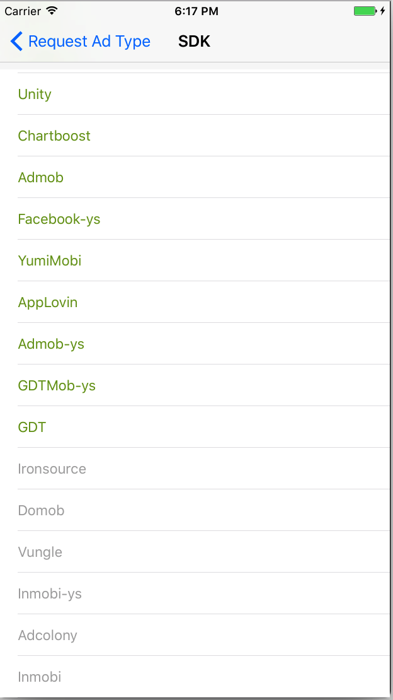
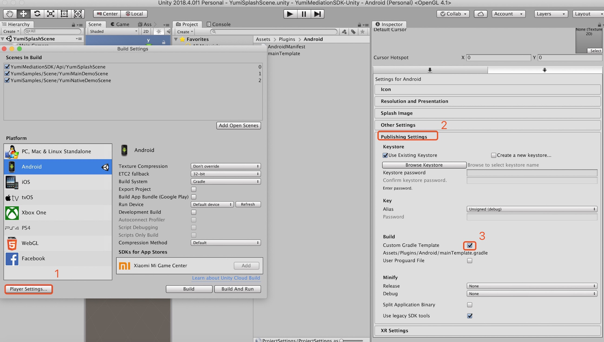

# 工具和调试
>通过 Yumi 中介功能测试套件，您可以测试是否正确配置了应用和广告单元，使其能够通过 Yumi 中介功能展示来自第三方广告联盟的广告。

# 调用调试模式

```C#
using YumiMediationSDK.Api;
using YumiMediationSDK.Common;

public class YumiSDKDemo : MonoBehaviour
{
   private YumiDebugCenter debugCenter;
  
   private void CallDebugCenter(){
        if (this.debugCenter == null)
        {
            this.debugCenter = new YumiDebugCenter();
        }
        // Note: Fill in the ad slot information to distinguish between iOS and Android
        this.debugCenter.PresentYumiMediationDebugCenter("YOUR_BANNER_PLACEMENT_ID", "YOUR_INTERSTITIAL_PLACEMENT_ID", "YOUR_REWARDVIDEO_PLACEMENT_ID", "YOUR_NATIVE_PLACEMENT_ID","YOUR_SPLASH_PLACEMENT_ID","YOUR_CHANNEL_ID", "YOUR_VERSION_ID");
    }
}
```

# 图示

Take the iOS platform as an example (the Android platform has the same logic but different UI).

<div align="center"></div>

*<p align="center" size=1>Select platform integration category</p>*

<div align="center"></div>

*<p align="center" size=1>Select single platform<br>If the platform you want is not in the list, it is not added to the project<br>The green platform is added to the project and configured<br>The grey platform is added to the project but not configured</p>*

<div align="center"></div>

*<p align="center" size=1>Select the AD type and debug the single platform</p>*

# TEST ID


| 系统    | 广告类型       | Slot(Placement) ID | 备注                                                                                                                                       |
| ------- | -------------- | ------------------ | ------------------------------------------------------------------------------------------------------------------------------------------ |
| Android | Banner         | uz852t89           | YUMI,AdMob,APPlovin,Baidu,IQzone 使用此test id,以上Network平台可测试到对应平台广告                                                         |
| Android | Interstitial   | 56ubk22h           | YUMI,AdMob,APPlovin,Baidu,IronSource,Inmobi,IQzone, untiy Ads，vungle, ZPLAYAds 使用此test id,以上Network平台可测试到对应平台广告          |
| Android | Rewarded Video | ew9hyvl4           | YUMI,AdMob,APPlovin,GDTMob,IronSource,Inmobi,IQzone, untiy Ads，vungle, ZPLAYAds 使用此test id,以上Network平台可测试到对应平台广告         |
| Android | Native         | dt62rndy           | YUMI,AdMob,Baidu,GDTMob,Facebook 使用此test id,以上Network平台可测试到对应平台广告                                                         |
| iOS     | Banner         | l6ibkpae           | YUMI,AdMob,APPlovin,Baidu,Facebook,GDTMob  使用此test id,以上Network平台可测试到对应平台广告                                               |
| iOS     | Interstitial   | onkkeg5i           | YUMI,AdMob,Baidu,Chartboost,GDTMob,IronSource,Inmobi,IQzone, untiy Ads，vungle, ZPLAYAds 使用此test id,以上Network平台可测试到对应平台广告 |
| iOS     | Rewarded Video | 5xmpgti4           | YUMI,AdMob,Adcolony, APPlovin,IronSource,Inmobi,Mintegral, untiy Ads，vungle, ZPLAYAds 使用此test id,以上Network平台可测试到对应平台广告   |
| iOS     | Native         | atb3ke1i           | YUMI,AdMob,Baidu,GDTMob,Facebook 使用此test id,以上Network平台可测试到对应平台广告                                                         |

# 常见问题解答
## Failed to find Build Tools...
```
* What went wrong:
A problem occurred configuring root project 'gradleOut'.
> Failed to find Build Tools revision 29.0.0
```

**解决方法**

从 [mainTemplet](../../Assets/Plugins/Android/mainTemplate.gradle) 中删除 `buildToolsVersion '**BUILDTOOLS**'` 

## No toolchains found...
```
* What went wrong:
A problem occurred configuring root project 'gradleOut'.
> No toolchains found in the NDK toolchains folder for ABI with prefix: mips64el-linux-android
```

**解决方法**

修改 [mainTemplet](../../Assets/Plugins/Android/mainTemplate.gradle) 中 gradle plugin 版本，如将 `classpath 'com.android.tools.build:gradle:3.0.1'` 修改为 `classpath 'com.android.tools.build:gradle:3.2.1'`。

## Failed to apply plugin...
```
* What went wrong:
A problem occurred evaluating root project 'gradleOut'.
> Failed to apply plugin [id 'com.android.application']
   > Minimum supported Gradle version is 4.6. Current version is 4.2.1. If using the gradle wrapper, try editing the distributionUrl in
```

**解决方法（以下方法任选一个即可）**

1. 升级 gradle 版本至 4.6
2. 降级 gradle plugin 版本至 gradle 4.2.1 对应的版本。对照 [Update Gradle](https://developer.android.com/studio/releases/gradle-plugin#updating-gradle) 文档可知需要将 [mainTemplet](../../Assets/Plugins/Android/mainTemplate.gradle) 中 `classpath 'com.android.tools.build:gradle:x.x.x'` 修改为 `classpath 'com.android.tools.build:gradle:3.0.0+'`
## 加载三方 SDK 时间过长
执行 Android Resolver -> Resolve/Force resolve 时，插件会自动下载并导入相关 aar。如果添加多个平台，各平台依赖库版本不一致时插件会尝试自动解决依赖冲突，此过程可能耗时较长，请耐心等待。解决冲突时，尽量不要操作 Unity IDE，否则 Unity IDE 可能会出现卡死现象。

## 64k 引用限制
添加过多三方 SDK 会导致 64k 引用限制问题，可以通过以下方式之一解决此问题：

解决方案一：查看 Unity 工程 Assets/Plugins/Android/ 下是否有 AndroidManifest.xml 与 mainTemplate.gradle 文件，若没有则复制此文件并添加到 Assets/Plugins/Android/ 目录下，文件地址：[AndroidManifest.xml](https://github.com/yumimobi/YumiMediationSDK-Unity/blob/master/Assets/Plugins/Android/AndroidManifest.xml)，[mainTemplate.gradle](https://github.com/yumimobi/YumiMediationSDK-Unity/blob/master/Assets/Plugins/Android/mainTemplate.gradle)；如果有这两个文件，则修改 AndroidManifest.xml 文件，如下：
```xml
<manifest>
  ...
  <application
      android:name="android.support.multidex.MultiDexApplication"
      ...
      >
      ...
  </application>
  ...
</manifest>
```
修改 mainTemplate.gradle 如下
```groovy
allprojects {
  repositories {
    google()
    jcenter()
    ...
  }
}
dependencies {
  ...
  implementation 'com.android.support:multidex:1.0.3'
  ...
**DEPS**}
```

解决方案二：将项目导出 Android Studio 工程，然后根据 [规避 64K 限制](https://developer.android.com/studio/build/multidex#avoid) 方案解决。

## 点击 Android Resolver/Force Resolve选项加载SDK提示失败。
点击 Assets/Play Services Resolver/Android Resolver/Force Resolve选项出现下面的报错日志：
```
stderr:
Exception in thread "main" java.lang.RuntimeException: Timeout of 120000 reached waiting for exclusive access to file: /.gradle/wrapper/dists/gradle-5.1.1-bin/90y9l8txxfw1s2o6ctiqeruwn/gradle-5.1.1-bin.zip
	at org.gradle.wrapper.ExclusiveFileAccessManager.access(ExclusiveFileAccessManager.java:61)
	at org.gradle.wrapper.Install.createDist(Install.java:48)
	at org.gradle.wrapper.WrapperExecutor.execute(WrapperExecutor.java:128)
	at org.gradle.wrapper.GradleWrapperMain.main(GradleWrapperMain.java:61)
```
请检查你Unity项目中的Assets/Plugin/Android/mainTemplate.gradle文件是否存在，如果不存在，请添加mainTemplate.gradle文件

使用Unity工具生成mainTemplate.gradle文件：

<div align="center"></div>

## android 9.0 适配
目前一些平台Android SDK暂不支持Android9.0以上操作系统，比如 Mintegral 平台，如果在Android9.0以上系统出现的崩溃，可以通过以下方法解决。

- 将targaetSDKveriosn设置为27或者27以下。

## 设置 Admob MANAGER (不设置此项应用启动会崩溃)
- iOS 更新您的 info.plist 文件。[Admob 相关文档](https://developers.google.com/admob/ios/quick-start?hl=zh-cn) 
- Android 更新您的 AndroidManifest.xml。[Admob 相关文档](https://developers.google.com/admob/android/quick-start?hl=zh-cn)

## Gdt(广点通)平台常见问题：
### 接入Gdt(广点通) 原生广告后，出现广点通原生广告视频显示不出来问题：

**解决方法**

请确保你Unity项目的Assets/Plugins/Android/AndroidManifest.xml中的package:"xxx.xxx.xxx"名称和你Unity项目的package name "xxx.xxx.xxx"保持一致。如下图所示：


### Gdt(广点通) 平台请求不到广告问题：

**解决方法**

确认Gdt(广点通) 平台需要的权限已添加
```
<uses-permission android:name="android.permission.READ_PHONE_STATE" />
<uses-permission android:name="android.permission.WRITE_EXTERNAL_STORAGE" />
<uses-permission android:name="android.permission.ACCESS_COARSE_LOCATION" />  
<uses-permission android:name="android.permission.ACCESS_COARSE_UPDATES"/>
```


## Baidu 平台常见问题：

### Baidu 平台请求不到广告问题：

**解决办法**

确认百度平台需要的权限已添加
```
<uses-permission android:name="android.permission.READ_PHONE_STATE" />
<uses-permission android:name="android.permission.WRITE_EXTERNAL_STORAGE" />
<uses-permission android:name="android.permission.ACCESS_COARSE_LOCATION" />
```
