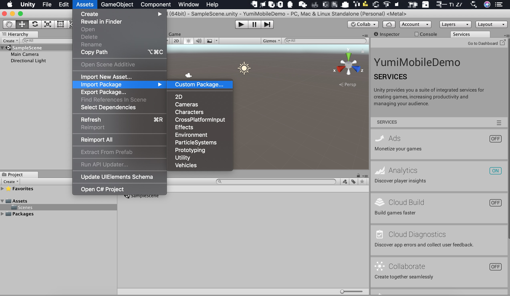
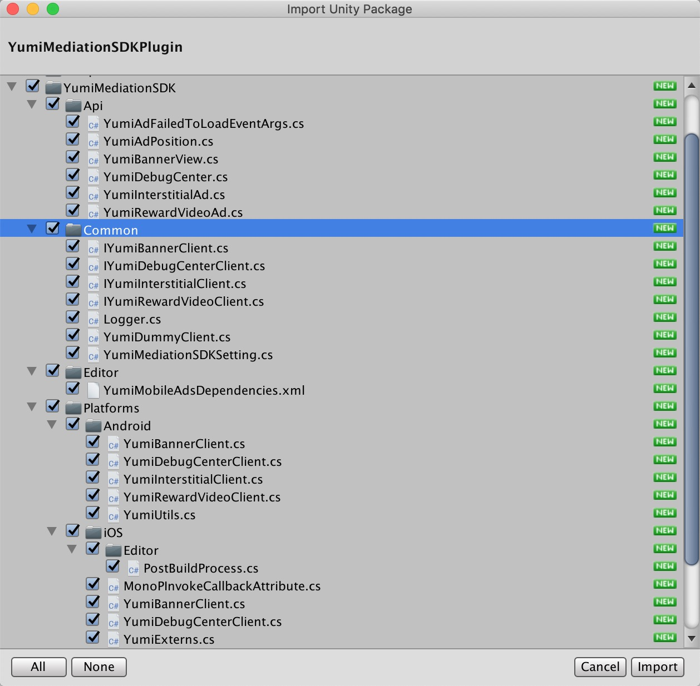
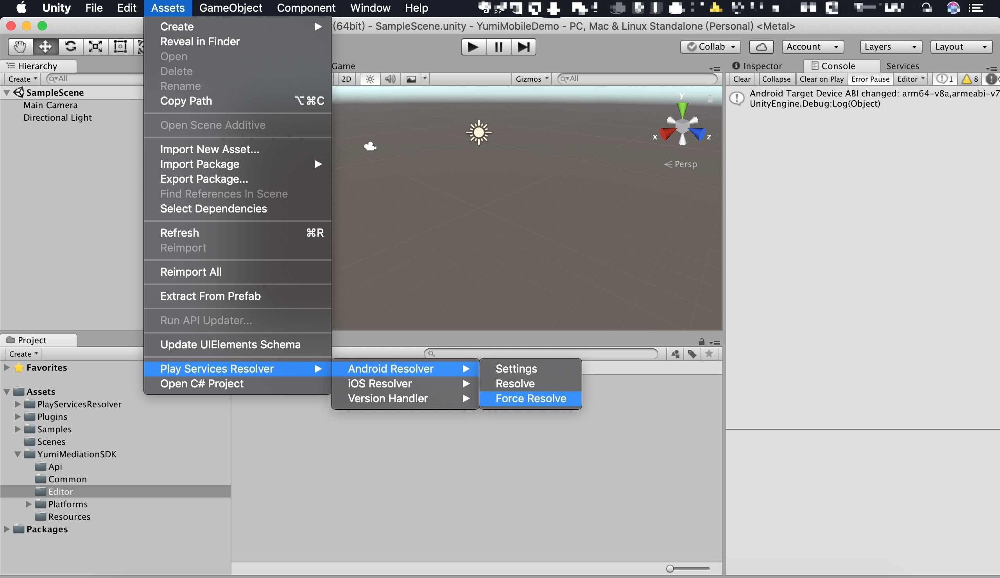

# 概述
将 YumiMediationSDK Unity 插件集成到应用程序中是展示 Yumi 广告并获得收入的第一步。 集成完成后，您可以选择一种广告格式（例如插屏或奖励视频）去集成到您的 Unity App中。

# 前提条件
- Unity 5.6 或更高版本

   - 部署 iOS
     
     Xcode 7.0 或更高版本
     
     iOS 8.0 或更高版本

     [CocoaPods](https://guides.cocoapods.org/using/getting-started.html)

   - 部署 Android

     Android SDK： > 4.1 (API level 16)

  [Demo 获取地址](https://github.com/yumimobi/YumiMediationSDK-Unity) 

# 下载 YumiMediationSDK Unity 插件
Yumi 聚合广告 Unity 插件使 Unity 开发人员可以轻松地在 Android 和 iOS 应用上展示广告，无需编写 Java 或 Objective-C 代码。该插件提供了一个 C# 接口来请求广告。使用下面的链接下载插件的 Unity 包或在 GitHub 上查看其代码。

[下载YumiMediationSDK Unity插件](https://github.com/yumimobi/YumiMediationSDK-Unity/raw/master/YumiMediationSDKPlugin.unitypackage)

[查看源码](https://github.com/yumimobi/YumiMediationSDK-Unity)

# 导入 YumiMediationSDK Unity 插件
## 首次导入
在 Unity 编辑器中打开您的项目。选择**Assets> Import Package> Custom Package**，找到您下载的 YumiMediationSDKPlugin.unitypackage 文件。



确保选中所有文件，然后单击 **Import**.



## 升级插件

删除 Assets/YumiMediationSDK 目录，并按照 3.1 所述重新导入。

删除 Assets/PlayServicesResolver目录，并按照3.1所述重新导入。

新版本插件将桥接文件 Assets/Plugins/Android/unity-plugin-library.jar 和 Assets/Plugins/iOS/* 转移到 Assets/YumiMediationSDK/../ 下，如果之前导入过这些桥接文件，请将其删除，否则会出现编译错误。

# 集成 YumiMediationSDK

YumiMediationSDK Unity 插件随着 [Unity Play Services Resolver library](https://github.com/googlesamples/unity-jar-resolver) 一起发布。这个库适用于任何需要访问 Android 特定库(例如 AARs )或 iOS CocoaPods 的 Unity 插件。它为 Unity 插件提供了声明依赖关系的能力，然后自动解析并复制到 Unity 项目中。请按照下面列出的步骤确保您的项目包含 YumiMediationSDK。

## 部署 iOS 项目

将 YumiMediationSDK 集成到 Unity 项目中无需其他步骤。

如果你想要修改 YumiMediationSDK 依赖的库，请修改 **Assets/YumiMediationSDK/Editor/YumiMobileAdsDependencies.xml**  文件，iOS 依赖如下：

```xml
    <iosPods>
        <iosPod name="YumiMediationSDK" version="4.3.3" minTargetSdk="8.0">
            <sources>
                <source>https://github.com/CocoaPods/Specs</source>
            </sources>
        </iosPod>
        <!-- adapters -->
        <iosPod name="YumiMediationAdapters/AdColony" version="4.3.2">
        </iosPod>
        <iosPod name="YumiMediationAdapters/AdMob" version="4.3.2">
        </iosPod>
        <iosPod name="YumiMediationAdapters/AppLovin" version="4.3.2">
        </iosPod>
        <iosPod name="YumiMediationAdapters/Baidu" version="4.3.2">
        </iosPod>
        <iosPod name="YumiMediationAdapters/Chartboost" version="4.3.2">
        </iosPod>
        <iosPod name="YumiMediationAdapters/Domob" version="4.3.2">
        </iosPod>
        <iosPod name="YumiMediationAdapters/Facebook" version="4.3.2">
        </iosPod>
        <iosPod name="YumiMediationAdapters/GDT" version="4.3.2">
        </iosPod>
        <iosPod name="YumiMediationAdapters/InMobi" version="4.3.2">
        </iosPod>
        <iosPod name="YumiMediationAdapters/IronSource" version="4.3.2">
        </iosPod>
        <iosPod name="YumiMediationAdapters/Unity" version="4.3.2">
        </iosPod>
        <iosPod name="YumiMediationAdapters/Vungle" version="4.3.2">
        </iosPod>
        <iosPod name="YumiMediationAdapters/Mintegral" version="4.3.2">
        </iosPod>
        <iosPod name="YumiMediationAdapters/OneWay" version="4.3.2">
        </iosPod>
        <iosPod name="YumiMediationAdapters/ZplayAds" version="4.3.2">
        </iosPod>
        <iosPod name="YumiMediationAdapters/TapjoySDK" version="4.3.2">
        </iosPod>
         <iosPod name="YumiMediationAdapters/BytedanceAds" version="4.3.2">
        </iosPod>
        <iosPod name="YumiMediationAdapters/InneractiveAdSDK" version="4.3.2">
        </iosPod>
        <iosPod name="YumiMediationAdapters/PubNative" version="4.3.2">
        </iosPod>
        <!-- debugCenter -->
        <iosPod name="YumiMediationDebugCenter-iOS" version="4.3.2">
        </iosPod>
    </iosPods>
```

比如删除 `AdMob` ，直接删除 ` <iosPod name="YumiMediationAdapters/AdMob" version="4.3.2"></iosPod>`  即可。

构建完成，打开 **xcworkspace** 工程。

**注意：使用 CocoaPods 识别 iOS 依赖项。 CocoaPods 作为后期构建过程步骤运行。**
**注意: CocoaPods 会自动引用第三方 SDK，您无需手动添加。**

## 部署 Android 项目

在 Unity 编辑器中，选择 **Assets> Play Services Resolver> Android Resolver>Force Resolve**。 Unity Play 服务解析器库会将声明的依赖项复制到 Unity 应用程序的 **Assets/Plugins/Android** 目录中。



如果你想要修改 YumiMediationSDK 依赖的库，请修改 **Assets/YumiMediationSDK/Editor/YumiMobileAdsDependencies.xml**  文件，Android 依赖如下：

```xml
<androidPackages>
  <androidPackage spec="com.yumimobi.ads:mediation:4.3.0" />
  <androidPackage spec="com.yumimobi.ads.mediation:adcolony:4.3.0" />
  <androidPackage spec="com.yumimobi.ads.mediation:applovin:4.3.0" />
  <androidPackage spec="com.yumimobi.ads.mediation:playableads:4.3.0" />
  <androidPackage spec="com.yumimobi.ads.mediation:pubnative:4.3.0" />
  <androidPackage spec="com.yumimobi.ads.mediation:admob:4.3.0" />
  <androidPackage spec="com.yumimobi.ads.mediation:baidu:4.3.0" />
  <androidPackage spec="com.yumimobi.ads.mediation:bytedance:4.3.0"/>
  <androidPackage spec="com.yumimobi.ads.mediation:chartboost:4.3.0" />
  <androidPackage spec="com.yumimobi.ads.mediation:facebook:4.3.0" />
  <androidPackage spec="com.yumimobi.ads.mediation:gdt:4.3.0" />
  <androidPackage spec="com.yumimobi.ads.mediation:inmobi:4.3.0" />
  <androidPackage spec="com.yumimobi.ads.mediation:inneractive:4.3.0"/>
  <androidPackage spec="com.yumimobi.ads.mediation:oneway:4.3.0" />
  <androidPackage spec="com.yumimobi.ads.mediation:vungle:4.3.0" />
  <androidPackage spec="com.yumimobi.ads.mediation:ironsource:4.3.0" />
  <androidPackage spec="com.yumimobi.ads.mediation:ksyun:4.3.0" />
  <androidPackage spec="com.yumimobi.ads.mediation:mintegral:4.3.0" />
  <androidPackage spec="com.yumimobi.ads.mediation:tapjoy:4.3.0" />
  <androidPackage spec="com.yumimobi.ads.mediation:unity:4.3.0" />
  <repositories>
      <repository>https://dl.bintray.com/yumimobi/thirdparty/</repository>
      <repository>https://dl.bintray.com/yumimobi/ads/</repository>
       <repository>https://dl.bintray.com/pubnative/maven</repository>
      <repository>https://tapjoy.bintray.com/maven</repository>
      <repository>https://jcenter.bintray.com/</repository>
      <repository>https://maven.google.com/</repository>
  </repositories>
</androidPackages>
```

比如删除 `admob`，直接删除 `<androidPackage spec="com.yumimobi.ads.mediation:admob:4.3.0" />` 即可。

**注意: Unity 插件会自动引用第三方广告 SDK，您无需手动添加。**