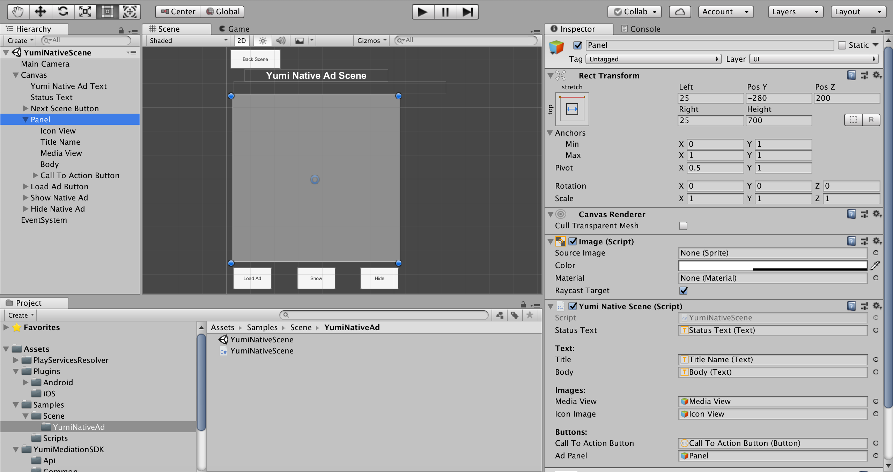

# 原生广告
> 原生广告无论是在形式上还是功能上都与广告投放到的内容相契合，可为用户带来浑然一体的体验。

本指南介绍了如何使用 YumiMediationSDK Unity 插件在 Unity 应用中展示 Yumi 原生广告。

# 前提条件
完成[入门指南](https://github.com/yumimobi/YumiMediationSDK-Unity-wiki/wiki/GetStarted(cn))的介绍。您的 Unity 应用应该已经导入了 YumiMediationSDK Unity 插件。

# 创建原生广告
要展示原生广告，首先要在附加到 `GameObject` 的脚本中创建 `YumiNativeAd` 对象。

```C#
using UnityEngine;
using UnityEngine.UI;
using System;
using System.Collections;
using System.Collections.Generic;
using UnityEngine.SceneManagement;
using YumiMediationSDK.Api;
using YumiMediationSDK.Common;

public class YumiNativeScene : MonoBehaviour
{
    private YumiNativeAd nativeAd;
    private YumiNativeData yumiNativeData;
    // UI elements in scene
    [Header("Text:")]
    public Text title;
    public Text body;
    [Header("Images:")]
    public GameObject mediaView;
    public GameObject iconImage;
    [Header("Buttons:")]
    // This doesn't be a button - it can also be an image
    public Button callToActionButton;

    // ad panel
    public GameObject adPanel;
  
    void Start()
    {
        this.InitNativeAd();
    }
    private void InitNativeAd()
    {
        string gameVersionId = "YOUR_VERSION_ID";
        string channelId = "YOUR_CHANNEL_ID";
        #if UNITY_ANDROID
          string nativePlacementId = "YOUR_NATIVE_PLACEMENT_ID_ANDROID";
        #elif UNITY_IOS
          string nativePlacementId = "YOUR_NATIVE_PLACEMENT_ID_IOS";
        #else
          string nativePlacementId = "unexpected_platform";
        #endif
       // you must set native  express ad view  transform if you want to support native express ad
        NativeAdOptionsBuilder builder = new NativeAdOptionsBuilder();
        builder.setExpressAdViewTransform(adPanel.transform);

        YumiNativeAdOptions options = new YumiNativeAdOptions(builder);
        // YumiNativeAdOptions options = new NativeAdOptionsBuilder().Build(); // only native ad
        nativeAd = new YumiNativeAd(NativePlacementId, ChannelId, GameVersionId, gameObject,options);
        // call back
        nativeAd.OnNativeAdLoaded += HandleNativeAdLoaded;
        nativeAd.OnAdFailedToLoad += HandleNativeAdFailedToLoad;
        nativeAd.OnAdClick += HandleNativeAdClicked;
        /// ------only available in ExpressAdView------
        nativeAd.OnExpressAdRenderSuccess += HandleNativeExpressAdRenderSuccess;
        nativeAd.OnExpressAdRenderFail += HandleNativeExpressAdRenderFail;
        nativeAd.OnExpressAdClickCloseButton += HandleNativeExpressAdClickCloseButton;
    }
    #region native call back handles
    public void HandleNativeAdLoaded(object sender, YumiNativeToLoadEventArgs args)
    {
        Logger.Log("HandleNativeAdLoaded event opened");
        if (nativeAd == null)
        {
            Logger.Log("nativeAd is null");
            return;
        }

        if (args == null || args.nativeData == null || args.nativeData.Count == 0)
        {
            Logger.Log("nativeAd data not found.");
            return;
        }
        // args.nativeData is nativeAd data
      	yumiNativeData = args.nativeData[0];
    }
    public void HandleNativeAdFailedToLoad(object sender, YumiAdFailedToLoadEventArgs args)
    {
        Logger.Log("HandleNativeAdFailedToLoad event received with message: " + args.Message);
    }
    public void HandleNativeAdClicked(object sender, EventArgs args)
    {
        Logger.Log("HandleNativeAdClicked");
    }
     /// ------only available in ExpressAdView------
     public void HandleNativeExpressAdRenderSuccess(object sender , YumiNativeDataEventArgs args)
    {
        Logger.Log("HandleNativeExpressAdRenderSuccess");
    }
    public void HandleNativeExpressAdRenderFail(object sender, YumiAdFailedToRenderEventArgs args)
    {
        Logger.Log("HandleNativeExpressAdRenderFail" + args.Message + "data id is " + args.nativeData.uniqueId);
    }
    public void HandleNativeExpressAdClickCloseButton(object sender, YumiNativeDataEventArgs args)
    {
        Logger.Log("HandleNativeExpressAdClickCloseButton" + args.nativeData.uniqueId);
    }
    #endregion
}
```
# 原生广告的高级设置
`YumiNativeAdOptions` 是初始化 `YumiNativeAd` 的最后一个参数，可以配置原生广告显示的样式，参数详情如下：

```C#
// AdOptionViewPosition: TOP_LEFT,TOP_RIGHT,BOTTOM_LEFT,BOTTOM_RIGHT
public AdOptionViewPosition adChoiseViewPosition { get; private set; }
// AdAttribution: AdOptionsPosition、text、textColor、backgroundColor、textSize、hide
public AdAttribution adAttribution { get; private set; }
// TextOptions: textSize，textColor，backgroundColor
public TextOptions titleTextOptions { get; private set; }
public TextOptions descTextOptions { get; private set; }
public TextOptions callToActionTextOptions { get; private set; }
// ScaleType: SCALE_TO_FILL、SCALE_ASPECT_FIT、SCALE_ASPECT_FILL
public ScaleType iconScaleType { get; private set; }
public ScaleType coverImageScaleType { get; private set; }
// native express ad view  transform
public Transform expressAdViewTransform { get; private set; }
```

默认创建 `YumiNativeAdOptions` 实例代码：
```C#
YumiNativeAdOptions options = new NativeAdOptionsBuilder().Build();
```
自定义创建 `YumiNativeAdOptions` 实例代码：
```C#
 NativeAdOptionsBuilder builder = new NativeAdOptionsBuilder();
 builder.setExpressAdViewTransform(adPanel.transform);

 YumiNativeAdOptions options = new YumiNativeAdOptions(builder);
```
**如果要支持原生模板广告必须使用 `builder.setExpressAdViewTransform(adPanel.transform);` 创建 options 对象**

# 请求原生广告

```C#
int adCount = 1;// adCount: you can load more than one ad
this.nativeAd.LoadAd(adCount);
```

# 创建原生广告布局

```C#
public class YumiNativeScene : MonoBehaviour
  {
    private YumiNativeAd nativeAd;
    // UI elements in scene
    [Header("Text:")]
    public Text title;
    public Text body;
    [Header("Images:")]
    public GameObject mediaView;
    public GameObject iconImage;
    [Header("Buttons:")]
    // This doesn't be a button - it can also be an image
    public Button callToActionButton;
    /// ...
  }
```

以下说明这些元素如何与编辑器中的视图关联：



# 使用广告元数据注册布局

```C#
public class YumiNativeScene : MonoBehaviour
{
  private YumiNativeAd nativeAd;
  private YumiNativeData yumiNativeData;
  private void RegisterNativeViews()
    {
        Dictionary<NativeElemetType, Transform> elementsDictionary = new Dictionary<NativeElemetType, Transform>();
        elementsDictionary.Add(NativeElemetType.PANEL, adPanel.transform);
        elementsDictionary.Add(NativeElemetType.TITLE, title.transform);
        elementsDictionary.Add(NativeElemetType.DESCRIPTION, body.transform);
        elementsDictionary.Add(NativeElemetType.ICON, iconImage.transform);
        elementsDictionary.Add(NativeElemetType.COVER_IMAGE, mediaView.transform);
        elementsDictionary.Add(NativeElemetType.CALL_TO_ACTION, callToActionButton.transform);
        // This is a method to associate a YumiNativeData with the ad assets gameobject you will use to display the native ads.
        nativeAd.RegisterNativeDataForInteraction(yumiNativeData, elementsDictionary);

    }
}
```

# 展示原生广告视图
1. 原生广告

```C#
// Determines whether nativeAd data is invalidated, if invalidated please reload
if (this.nativeAd.IsAdInvalidated(yumiNativeData))
  {
      Logger.Log("Native Data is invalidated");
      return;
  }
// the ad is native ad
if (!yumiNativeData.isExpressAdView)
  {
    this.nativeAd.ShowView(yumiNativeData);
  }
```
2. 原生模板广告
```C#
  // if the ad is native express view please show ad in HandleNativeExpressAdRenderSuccess
  if (yumiNativeData.isExpressAdView)
  {
    // ...
  }
```
- 注意：显示广告前，您必须注册布局并检查广告是否已经无效。

# 隐藏原生广告视图

```C#
this.nativeAd.HideView(yumiNativeData);// Hide nativeAd data associate view
```

# 移除原生广告视图

此方法的作用：从屏幕上移除当前广告视图，断开 View 和 广告元数据的注册。在显示一个新广告时，请先调用这个方法。

```C#
this.nativeAd.UnregisterView(yumiNativeData);
```

# 销毁原生广告

```C#
this.nativeAd.Destroy();
```