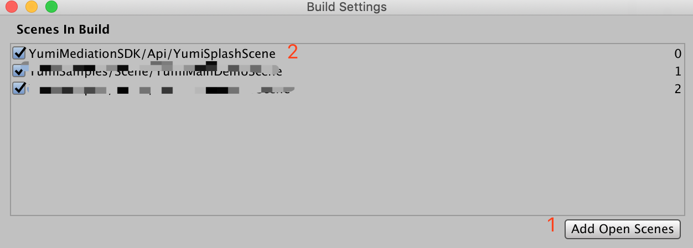

# 开屏广告
>开屏广告是一种特殊的广告格式，可让您通过应用加载屏幕获利。 当用户冷启动您的应用或将其带到前台时，就会显示广告。广告显示几秒钟后，您的用户可以随时将其关闭。

本指南介绍了如何使用 YumiMediationSDK Unity 插件在 Unity 应用中展示 Yumi 开屏广告。

# 前提条件
完成[入门指南](https://github.com/yumimobi/YumiMediationSDK-Unity-wiki/wiki/GetStarted(cn))的介绍。您的 Unity 应用应该已经导入了 YumiMediationSDK Unity 插件。

# 集成开屏广告
如果您的 APP 想要集成开屏广告形式，请把 `YumiSplashScene` 加到 **Scenes In Build** 的第一位。如下图所示：


**建议:** 
建议您将 `YumiSplashScene` 的背景图片设置为您应用的 launchImage。

# 设置开屏广告位
在 **YumiMediationSDK/Api/YumiSplashScript** 文件的 `void Start()` 方法中配置您的广告位信息。
```C#
void Start()
    {
      #if UNITY_ANDROID
        SplashPlacementId = "YOUR_SPLASH_PLACEMENT_ID_ANDROID";
      #elif UNITY_IOS
        SplashPlacementId = "YOUR_SPLASH_PLACEMENT_ID_IOS";
      #else
        SplashPlacementId = "unexpected_platform";
      #endif
      // 如无特殊需求，GameVersionId，ChannelId 可设置为空字符串。
      GameVersionId = "YOUR_GAME_VERSION";
      ChannelId = "YOUR_CHANNEL_ID";
      // ...
    }
```
# 处理开屏广告回调
当开屏回调失败或者关闭时，请打开您的 APP SCENE。
在如下方法中，修改 `YOUR_MAIN_SCENE` 为您 main scene 的名字。
```C#
    private void InputMainSence()
    {
        SceneManager.LoadScene("YOUR_MAIN_SCENE");
    }
```

# 开屏广告的高级设置
`YumiSplashOptions` 是初始化 `YumiSplashAd` 的最后一个参数，您可在 `YumiSplashOptions` 文件中查看：
- `adFetchTime`

  拉取广告超时时间，默认为3秒 。在该超时时间内，如果广告请求成功则展示广告，否则展示失败。

- `adOrientation`

  开屏广告方向。默认竖屏。只有 Admob 广告平台支持这个方法

- `adBottomViewHeight`

  广告底部视图的高度。广告底视图的高度不应超过屏幕高度的15％。


创建默认 `YumiSplashOptions` 实例代码：
```C#
YumiSplashOptions splashOptions = new YumiSplashOptionsBuilder().Build();
```

创建自定义 `YumiSplashOptions` 实例代码：
```C#
YumiSplashOptionsBuilder builder = new YumiSplashOptionsBuilder();
builder.setAdBottomViewHeight(100);
builder.setAdFetchTime(3);
builder.setAdOrientation(YumiSplashOrientation.YUMISPLASHORIENTATION_PORTRAIT);

YumiSplashOptions splashOptions = new YumiSplashOptions(builder);
```

# 显示半屏广告
显示半屏广告，可允许您在 bottomView 位置展示应用 logo。
请修改开屏的初始化代码
```C#
/// bottom view's height should not exceed 15% of the screen height.
YumiSplashOptionsBuilder builder = new YumiSplashOptionsBuilder().setAdBottomViewHeight(100);
YumiSplashOptions splashOptions = new YumiSplashOptions(builder);

YumiSplashAd splashAd = new YumiSplashAd(SplashPlacementId, ChannelId, GameVersionId, splashOptions);

// ...

```